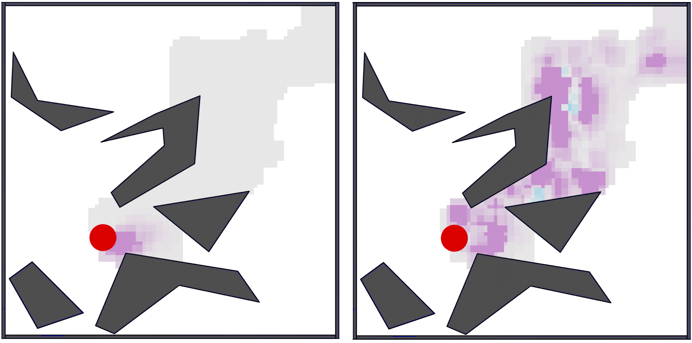

---

##### Download

+ [Paper](paper1.pdf)
<!-- + [Code and data](https://github.com/pmichaillat/feru) -->

---

##### Abstract

This paper investigates a new approach to model-based reinforcement learning using background planning: mixing (approximate) dynamic programming updates and model-free updates, similar to the Dyna architecture. Background planning with learned models is often worse than model-free alternatives, such as Double DQN, even though the former uses significantly more memory and computation. The fundamental problem is that learned models can be inaccurate and often generate invalid states, especially when iterated many steps. In this paper, we avoid this limitation by constraining background planning to a given set of (abstract) subgoals and learning only local, subgoal-conditioned models. This goal-space planning (GSP) approach is more computationally efficient, naturally incorporates temporal abstraction for faster long-horizon planning, and avoids learning the transition dynamics entirely. We show that our GSP algorithm can propagate value from an abstract space in a manner that helps a variety of base learners learn significantly faster in different domains.

---

##### Figure 6: Value Function update without (left) and with (right) Goal-Space Planning



---

##### Citation

Chunlok Lo, Kevin Roice, Parham Mohammad Panahi, Scott M. Jordan, Adam White, Gabor Michuz, Farzane Aminmansour, Martha White, "Goal-Space Planning with Subgoal Models", *Journal of Machine Learning Research* 25 (-): 1-57.

```BibTeX
@article{UI13,
author = {Chunlok Lo, Kevin Roice, Parham Mohammad Panahi, Scott M. Jordan, Adam White, Gabor Michuz, Farzane Aminmansour and Martha White},
year = {2024},
title ={Goal-Space Planning with Subgoal Models},
journal = {Journal of Machine Learning Research},
volume = {25},
number = {-},
pages = {1-57}}
```

---

<!-- ##### Related material

+ [Presentation slides](presentation1.pdf)
+ [Summary of the paper](https://www.penguinrandomhouse.com/books/110403/unusual-uses-for-olive-oil-by-alexander-mccall-smith/) -->
