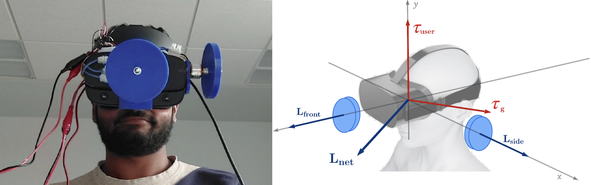

---

##### Download

+ [Paper](paper2.pdf)
+ [Online appendix](appendix2.pdf)
+ [Code and data](https://github.com/pmichaillat/wunk)

---

##### Abstract

This work investigates the use of rotational inertia from gyroscopic torques as a means of haptic feedback to augment Virtual Reality (VR) experiences. While modern VR systems are capable of fabricating visual and auditory immersion into alternate realities much better than the technologies from a couple decades ago, studies have long shown that forms of haptic engagement can effectively enrich this experience and be used as a means of communication. It is no surprise that after VR’s success with audio-visual modalities, haptics are the natural next step.

---

##### Figure 2: RHapTor Hardware on an Occulus Rift S



---

##### Citation

Kevin Roice and George A. Koulieris. 2022. "RHapTor: Rendering Haptic Torques for Virtual Reality" *SIGGRAPH* 2022 Posters.

```BibTeX
@article{PI04,
author = {Kevin Roice and George A. Koulieris},
year = {2022},
title ={RHapTor: Rendering Haptic Torques for Virtual Reality},
journal = {ACM SIGGRAPH}}
```

---

<!-- ##### Related material

+ [Presentation slides](presentation2.pdf)
+ [Wikipedia entry](https://en.wikipedia.org/wiki/The_Finer_Points_of_Sausage_Dogs) -->
